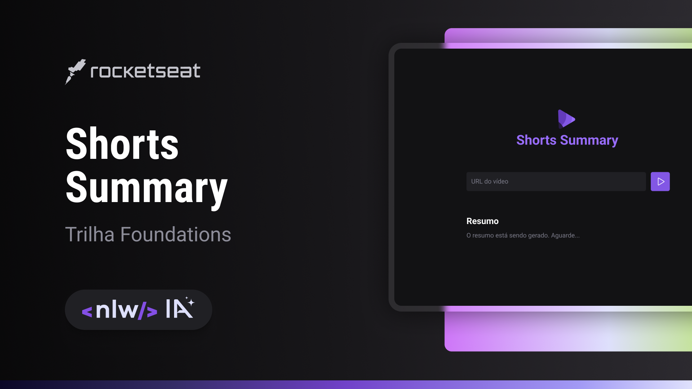

<h1 align="center"> Shorts Summary</h1>

A Rocketseat é uma escola de programação, com mais de 50 mil alunos e alunas. Também é a maior comunidade de pessoas desenvolvedoras da América Latina.  

  <a href="#-tecnologias">Tecnologias</a>&nbsp;&nbsp;&nbsp;|&nbsp;&nbsp;&nbsp;
  <a href="#-projeto">Projeto</a>&nbsp;&nbsp;&nbsp;|&nbsp;&nbsp;&nbsp;
  <a href="#-layout">Layout</a>&nbsp;&nbsp;&nbsp;|&nbsp;&nbsp;&nbsp;
  <a href="#memo-licença">Licença</a>

  

 

  

## 🚀 Tecnologias

Esse projeto foi desenvolvido com as seguintes tecnologias:

- HTML, CSS, JavaScript com Node.JS
- Git e Github
- Figma

## 💻 Projeto

Shorts Summary é uma aplicação web para criar resumo de vídeos shorts do Youtube utilizando Inteligência Artificial para transcrever o conteúdo do vídeo e realizar o resumo do conteúdo. Esse projeto é desenvolvido na trilha Foundations na edição NLW IA.

## 🔖 Layout

Você pode visualizar o layout do projeto através [DESSE LINK](<https://www.figma.com/file/mTOM97YwZk3RXDTQ0DWmzv/Shorts-Summary-%E2%80%A2-Trilha-Foundations-(Community)?type=design&node-id=301-171&mode=design&t=VFhlWeSdBEbYDIYx-0>). É necessário ter conta no [Figma](https://figma.com) para acessá-lo.

## :memo: Licença

Esse projeto está sob a licença MIT.

---

Feito com ♥ by Lucas :wave: [Participe da comunidade da RocketSeat!](https://discord.gg/rocketseat)
